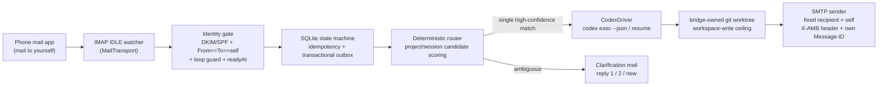

# Architecture (v0.1)

> Status: in progress — summarizes the authoritative spec
> ([roadmap design](superpowers/specs/2026-07-17-agent-mail-bridge-roadmap-design.md), §3)
> and tracks what is actually implemented. Updated at each phase exit.

## One-liner

Email is the universal, firewall-friendly async transport for AI agents: control
the coding agent on your own device from your own mailbox.

## Pipeline

## Module boundaries

See the per-directory READMEs under [`src/`](../src) — each answers: what it
does, who uses it, what it depends on. The two extension axes are
`MailTransport` (new mailbox providers) and `AgentDriver` (new agents); adding
either must not touch the core.

## Reliability model (IMAP edition)

| Concern | Mechanism |
| --- | --- |
| Incremental sync | `UIDVALIDITY` + UID high-water mark; `UID SEARCH` catch-up after reconnect |
| Delivery semantics | at-least-once ingest → persist before advancing the high-water mark; unique Message-ID index makes effects idempotent |
| IDLE keep-alive | proactive reconnect ≤ 29 min + periodic fallback poll (covers silent IDLE death) |
| Mailbox resets | bounded rescan on `UIDVALIDITY` change (INTERNALDATE + Message-ID dedupe, never earlier than `readyAt`) |
| Loop prevention | SMTP gives full MIME control: own `Message-ID` + `X-AMB-Outbox-ID` header → outbound mail is recognized as `SYSTEM_ECHO` before it is ever routed |

Design decisions D1–D10 and their rationale live in the spec (§2); future
architecture-level changes are recorded in [`adr/`](adr/).

## Implementation status

| Stage | State | Evidence |
| --- | --- | --- |
| Event core (`domain/` gates, `store/` state machines + transactional outbox, `application/ingest`, transport seam + in-memory fake) | **done** — Phase 2 exit criteria met under simulated IMAP: duplicate/reorder/crash-restart converge without duplicate commands; self-sent mail classified `SYSTEM_ECHO` 20/20 | [Phase 2 acceptance report](reports/phase-2-acceptance.md) |
| CLI skeleton (`cli/`: config layer, `doctor` local checks, `setup` writing the `readyAt` first-install fence) | **done** (early subset of Phase 5; daemon-dependent commands are honest placeholders) | [plan + completion record](superpowers/plans/2026-07-18-phase-5-cli-skeleton.md) |
| Phase 3 deterministic prework (`Authentication-Results` parser + fail-closed DKIM verdict, bridge-owned worktree manager, `AgentDriver` seam + scripted fake, dispatch-intent lifecycle + migration 002) | **done** — every piece test-pinned incl. adversarial cases (argv-injection guards, real-git symlink-escape, 5×5 transition matrix); wiring into ingest/daemon deferred to Phase 3 proper | [plan + completion record](superpowers/plans/2026-07-18-phase-3-prework-deterministic.md) |
| Real `imap-smtp` transport, identity gate wired with the DKIM factor, `CodexDriver`, router/clarification, daemon | **not started** — Phase 3/4; P0-1 read-only evidence collected, P0-2/P0-3 pending external inputs | [P0-1 spike](../spikes/p0-1-imap/README.md), spec §5 |
