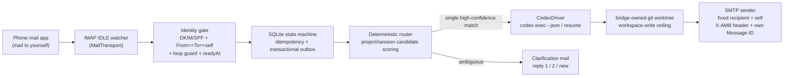

# Architecture (v0.1)

> Status: in progress — summarizes the authoritative spec
> ([roadmap design](superpowers/specs/2026-07-17-agent-mail-bridge-roadmap-design.md), §3)
> and tracks what is actually implemented. Updated at each phase exit.

## One-liner

Email is the universal, firewall-friendly async transport for AI agents: control
the coding agent on your own device from your own mailbox.

## Pipeline

## Module boundaries

See the per-directory READMEs under [`src/`](../src) — each answers: what it
does, who uses it, what it depends on. The two extension axes are
`MailTransport` (new mailbox providers) and `AgentDriver` (new agents); adding
either must not touch the core.

## Reliability model (IMAP edition)

| Concern | Mechanism |
| --- | --- |
| Incremental sync | `UIDVALIDITY` + UID high-water mark; `UID SEARCH` catch-up after reconnect |
| Delivery semantics | at-least-once ingest → persist before advancing the high-water mark; unique Message-ID index makes effects idempotent |
| IDLE keep-alive | proactive reconnect ≤ 29 min + periodic fallback poll (covers silent IDLE death) |
| Mailbox resets | bounded rescan on `UIDVALIDITY` change (INTERNALDATE + Message-ID dedupe, never earlier than `readyAt`) |
| Loop prevention | SMTP gives full MIME control: own `Message-ID` + `X-AMB-Outbox-ID` header → outbound mail is recognized as `SYSTEM_ECHO` before it is ever routed |

Design decisions D1–D10 and their rationale live in the spec (§2); future
architecture-level changes are recorded in [`adr/`](adr/).

## Implementation status

| Stage | State | Evidence |
| --- | --- | --- |
| Event core (`domain/` gates, `store/` state machines + transactional outbox, `application/ingest`, transport seam + in-memory fake) | **done** — Phase 2 exit criteria met under simulated IMAP: duplicate/reorder/crash-restart converge without duplicate commands; self-sent mail classified `SYSTEM_ECHO` 20/20 | [Phase 2 acceptance report](reports/phase-2-acceptance.md) |
| CLI skeleton (`cli/`: config layer, `doctor` local checks, `setup` writing the `readyAt` first-install fence) | **done** (early subset of Phase 5; daemon-dependent commands are honest placeholders) | [plan + completion record](superpowers/plans/2026-07-18-phase-5-cli-skeleton.md) |
| Phase 3 deterministic prework (`Authentication-Results` parser + fail-closed DKIM verdict, bridge-owned worktree manager, `AgentDriver` seam + scripted fake, dispatch-intent lifecycle + migration 002) | **done** — every piece test-pinned incl. adversarial cases (argv-injection guards, real-git symlink-escape, 5×5 transition matrix); wiring into ingest/daemon deferred to Phase 3 proper | [plan + completion record](superpowers/plans/2026-07-18-phase-3-prework-deterministic.md) |
| IMAP read path (`ImapReadTransport`: fetchSince with fail-closed UIDVALIDITY guard, multi-value header parsing, `\Seen` markProcessed; multi-instance `Authentication-Results` now survives the seam) | **done** — unit-tested against a scripted fake client and live-verified read-only against the dedicated test mailbox (3/3, incl. the RFC 3501 `n:*` quirk end-to-end); `send` fails loud pending the send confirmation | [plan + completion record](superpowers/plans/2026-07-19-phase-3-batch2-imap-read-path.md) |
| Project allowlist/index (operator-configured roots + git scan + alias table; exact lookup only — the "mail can never name a path" enforcement point) | **done** — real-git + fake-io dual-track tests incl. symlink-escape rejection reporting; router wiring is Phase 4 | [plan + completion record](superpowers/plans/2026-07-19-phase-3-batch3-project-index.md) |
| Clarification binding C8, deterministic half (fourth state machine + fail-closed four-factor binding check with fixed reason priority; migration 003 + `ClarificationStore` with the supersede-then-insert single-transaction invariant) | **done** — 38 tests; atomicity mutation-verified independently by implementer and reviewer; reply parsing/mail format wait on the real-device walkthrough | [plan + completion record](superpowers/plans/2026-07-19-phase-4-batch4-clarification-binding.md) |
| SMTP send half (`ImapReadTransport.send`: mint → register → submit order, C9 recipient lock, echo markers) | **done** — unit-pinned incl. deferred-promise await-order and exact-keys C9 tests; live-verified end-to-end (1 production-path self-send, `Message-ID` + `x-amb-outbox-id` round-trip, 12 s) | [plan + completion record](superpowers/plans/2026-07-19-phase-3-batch5-smtp-send.md), [ADR-0002](adr/0002-p0-1-gmail-imap-smtp-go.md) |
| `CodexDriver` on the `AgentDriver` seam (`codex exec --json` spawn/parse, session capture + resume, single-terminal-event contract, C6 argv ceiling) | **done** (zero-quota: scripted subprocess fakes; review ran 4 penetration experiments incl. a 300-round randomized concurrency harness) — real-task E2E stays user-gated behind red line 5 | [plan + completion record](superpowers/plans/2026-07-19-phase-4-batch6-codex-driver.md), [ADR-0004](adr/0004-p0-2-codex-exec-session-semantics.md) |
| Router core (`routeCommand` four-verdict pure function — thread continuity > unique exact match > clarify; fuzzy matching structurally impossible: the function never receives the full index) + thread↔session mapping (migration 004 + `SessionStore`, first-write invariant on the driver session id per ADR-0004) | **done** — 22 tests; 7 implementer mutation kills all independently reproduced by the reviewer, plus an exhaustive 2×3 verdict-matrix experiment; word extraction / mail format wait on the real-device walkthrough | [plan + completion record](superpowers/plans/2026-07-19-phase-4-batch7-router-core.md) |
| Dispatch pipeline (`dispatchIntent`: verdict → session commitment row → worktree → driver → intent terminal; migration 005 persists `worktree_path` so resume returns to the ORIGINAL tree, fail closed if missing; CLARIFY short-circuits with zero side effects; a terminal-less driver stream throws rather than fabricating an outcome) | **done** (zero-quota: FakeAgentDriver + injected fakes) — 29 tests; review ran 8 mutation experiments, the one surviving mutant (fabricated terminal) got a dedicated killer test in the fix round | [plan + completion record](superpowers/plans/2026-07-19-phase-4-batch8-dispatch-pipeline.md) |
| Reply composition + C9 rendering scrub (`src/domain/replyComposition.ts`: one scrub funnel — path placeholders, keyword-value masking, long-token heuristic, fixed order, idempotent — plus scrub-before-truncate size caps and four composers emitting already-redacted `OutboundMail`) | **done** — 44 tests; the batch-6/8 NON-OPTIONAL scrub obligation closed; review ran 44 adversarial probes + 20k-seed fuzz and its one Important (subject funnel order, a plan-level gap) got fixed with a mutation-killed regression test | [plan + completion record](superpowers/plans/2026-07-19-phase-4-batch9-reply-composition.md) |
| Mail content path (`IncomingMail.bodyText` via a `ParseMime` injection seam — mailparser behind a single import point, per-mail parse failure fails OPEN to `null`; `extractCommand` locking the v0.1 minimal command format: subject first token = project term, body = task prompt, thread key = References-root ?? In-Reply-To ?? own Message-ID with ingest-identical normalization; four store query surfaces for the daemon ticks) | **done** — 39 tests incl. live read-only body decode (4/4, zero content printing); review reproduced 6 mutation claims + a fail-open catch-scope probe (fatal fetch errors still propagate) | [plan + completion record](superpowers/plans/2026-07-19-phase-4-batch10-mail-content-path.md) |
| IDLE watch loop, identity gate wired with the (polarity-inverted) auth factor, daemon (PENDING intent feed, outcome→compose→send wiring, recovery contracts, EXPIRED sweep), clarification record/token + mail/reply parsing | **not started** — Phase 3/4. P0-1/P0-2 **complete: Go** ([ADR-0002](adr/0002-p0-1-gmail-imap-smtp-go.md), [ADR-0004](adr/0004-p0-2-codex-exec-session-semantics.md)); P0-3 **measured** — legitimate self-mail carries no `Authentication-Results`, gate polarity must invert, wiring blocked on the user accepting [ADR-0003](adr/0003-self-mail-carries-no-auth-results.md) | spec §5 |
