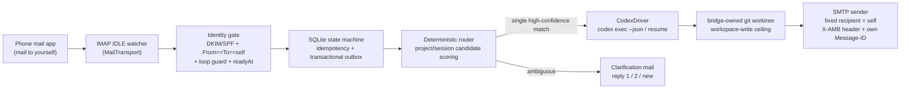

# Architecture (v0.1)

> Status: skeleton — summarizes the authoritative spec
> ([roadmap design](superpowers/specs/2026-07-17-agent-mail-bridge-roadmap-design.md), §3).
> This file grows alongside the implementation phases.

## One-liner

Email is the universal, firewall-friendly async transport for AI agents: control
the coding agent on your own device from your own mailbox.

## Pipeline

## Module boundaries

See the per-directory READMEs under [`src/`](../src) — each answers: what it
does, who uses it, what it depends on. The two extension axes are
`MailTransport` (new mailbox providers) and `AgentDriver` (new agents); adding
either must not touch the core.

## Reliability model (IMAP edition)

| Concern | Mechanism |
| --- | --- |
| Incremental sync | `UIDVALIDITY` + UID high-water mark; `UID SEARCH` catch-up after reconnect |
| Delivery semantics | at-least-once ingest → persist before advancing the high-water mark; unique Message-ID index makes effects idempotent |
| IDLE keep-alive | proactive reconnect ≤ 29 min + periodic fallback poll (covers silent IDLE death) |
| Mailbox resets | bounded rescan on `UIDVALIDITY` change (INTERNALDATE + Message-ID dedupe, never earlier than `readyAt`) |
| Loop prevention | SMTP gives full MIME control: own `Message-ID` + `X-AMB-Outbox-ID` header → outbound mail is recognized as `SYSTEM_ECHO` before it is ever routed |

Design decisions D1–D10 and their rationale live in the spec (§2); future
architecture-level changes are recorded in [`adr/`](adr/).
