# Gmail Codex Bridge 开发交接文档

> **归档说明（2026-07-17）**：本文是开发前研究的历史交接文档，仅作背景参考。
> 其中部分决策已被正式规格取代（如：默认接入从 Gmail API + Pub/Sub 改为 IMAP IDLE + SMTP、
> 项目定位从"私有、实验性"改为面向公众的开源项目、项目名改为 `agent-mail-bridge`）。
> 凡与规格冲突处，一律以 [`docs/superpowers/specs/2026-07-17-agent-mail-bridge-roadmap-design.md`](../superpowers/specs/2026-07-17-agent-mail-bridge-roadmap-design.md) 为准。

> 状态：开发前研究与架构交接  
> 日期：2026-07-17  
> 目标执行者：接手实现工作的 Codex/智能体  
> 建议项目名：`gmail-codex-bridge`  
> 建议仓库状态：私有、实验性、本地优先

## 1. 执行摘要

开发一个独立 Git 项目，让用户通过 Gmail 手机 App 给自己发送普通自然语言邮件，主动唤起本机 Codex，并动态选择项目和任务：

- 不要求邮件主题前缀、JSON、项目 ID 或任务 ID；
- 可动态匹配存量任务；只有 bridge-owned 且符合安全上限的空闲任务可原位追加，其他写请求在正确项目的隔离 worktree 中新建受限任务并语义续接；
- 支持运行星期、每日时间段、时区和排除日期；
- 通过 Gmail 返回已接收、排队、澄清、派发和完成结果；
- 无有效邮件时不启动模型，空闲模型调用数应为 0；
- 机器短期休眠或离线时依赖 Pub/Sub 保留和 Gmail history 补收；超过保留/历史窗口时进入有界恢复或人工确认，不能承诺无限期不丢。

这项工作已经超出单个 Skill 的职责。正确形态是：

1. 独立 Git 仓库管理常驻程序、OAuth、Pub/Sub、SQLite、Codex 协议适配、安装和测试；
2. `gmail-remote-control` Skill 保留为邮件语义、路由和移动端交互规范；
3. 原有 Scheduled Task 轮询模式作为兼容降级，不再作为默认模式。

最重要的产品边界：

> 当前未发现公开或受支持的方式，让独立本地守护进程直接取得或复用 Codex 内置 Gmail Connector 的 Google OAuth access token 或 refresh token；当前工具面也没有暴露凭据导出或委托接口。

当前可在 Codex 会话内调用的是 **Gmail Connector 工具能力**；独立 daemon 当前不能通过公开、受支持的接口复用的是 **Connector 底层 OAuth 凭据**。外部 App Server 能否无模型复用工具能力仍是 P0，而不是既成事实。

## 2. 用户目标与体验要求

### 2.1 目标体验

用户在 Gmail 手机 App 中给自己写信：

```text
主题：继续处理登录弹窗

正文：
继续昨天 ioa-ssh-cli 中两种登录弹窗的问题。
先分析日志和现有实现，不要直接改代码。
```

系统应当：

1. 识别这是本人控制邮件；
2. 在允许的运行窗口内立即处理，否则确定性排队；
3. 动态找到 `ioa-ssh-cli` 项目和最匹配的存量 Codex 任务；
4. 唯一高置信匹配时，若为合规 bridge-owned 任务则原位继续；否则在隔离 worktree 中新建受限任务并携带最小必要上下文；
5. 多个候选接近时发邮件让用户回复 `1`、`2`、`新建` 或项目名；
6. 不静默覆盖目标任务原有模型和推理设置；只有目标任务的有效权限不超过 bridge 安全上限时才允许继续，否则拒绝或新建受限任务；
7. 通过 Gmail 返回派发结果和最终结果。

### 2.2 不要求用户做的事

- 不要求记住项目或任务 ID；
- 不要求固定主题前缀；
- 不要求使用命令语法；
- 不要求手写文件路径；
- 不向用户暴露内部 thread ID；
- 不让用户理解 Pub/Sub、App Server 或 SQLite。

## 3. Gmail Connector 权限复用结论

### 3.1 当前结论

| 场景 | 是否可复用 Codex 内置 Gmail 连接 |
| --- | --- |
| Codex 会话、Skill 或 Scheduled Task 内搜索/读取/发送 Gmail | 可以，通过 Connector 暴露的工具 |
| 独立 daemon 直接调用 Gmail REST API | 不可以通过当前受支持接口复用 |
| 从 Connector 获取 access token 或 refresh token | 当前未发现公开或受支持的导出/委托接口，也不应尝试提取 |
| 用 Connector 调用 `users.watch`、`history.list` 或 Pub/Sub | 当前工具面不支持 |
| 用 Connector 直接订阅“新邮件事件” | 不支持 |
| 主动事件到达后，让 Codex 会话通过 Connector 读取指定 message ID | 原理可行，必须在 P0 中验证外部 App Server 会话能否稳定获得该 Connector |
| 用 Connector 发送 ACK/完成邮件 | Codex 会话内可行；是否适合作为 daemon 的可靠出站通道，需要 P0 验证 |

### 3.2 本机只读验证

本次研究执行了最小化的 Gmail `get_profile` 只读检查：

- 当前 Gmail 连接有效；
- 未读取任何邮件正文；
- 账户地址不写入本文档，也不得硬编码进仓库。

当前 Gmail Plugin/Connector 公开工具包括：

- profile；
- 搜索和按 message ID 读取；
- 读取 thread；
- 草稿、发送和转发；
- 标签、归档和 Trash 等操作。

当前工具面没有：

- `users.watch`；
- `history.list`；
- Pub/Sub subscription；
- webhook 注册；
- OAuth scope 查询；
- access/refresh token 导出；
- credential delegation。

本机安装的 Gmail Plugin 清单只引用一个不透明 Connector ID，不包含 OAuth client、token 或可供本地进程调用的 Connector endpoint。

OpenAI 文档将 Connector 描述为向 ChatGPT/Codex 暴露工具、执行认证和外部操作的服务层；插件可用性、Connector 访问、源系统授权和本地运行时权限是彼此独立的控制边界。参见：

- [OpenAI Plugins](https://learn.chatgpt.com/docs/plugins)
- [OpenAI Plugin controls](https://learn.chatgpt.com/docs/enterprise/apps-and-connectors)

### 3.3 禁止的实现方式

- 不读取或复制 Connector 私有状态；
- 不从 Keychain、Codex 私有数据库、网络流量或进程内存抓取 Gmail token；
- 不调用未公开的 Connector endpoint；
- 不把 Connector ID 当成 Gmail API credential；
- 不尝试复用 `~/.codex/auth.json`，它是 Codex/OpenAI 身份，不是 Gmail OAuth；
- 不把当前实现偶然暴露的私有文件格式当成兼容契约。

### 3.4 三种认证与数据路径

#### 方案 A：Metadata 事件桥 + 内置 Gmail Connector

这是最值得先验证的方案。

本地 bridge 自己申请：

```text
https://www.googleapis.com/auth/gmail.metadata
```

该授权只用于：

- `users.watch`；
- `history.list`；
- 从 history 取得 message ID；
- 再调用 `messages.get(format=METADATA, metadataHeaders=[...])` 获取系统标签和所需邮件头；
- 校验 `From`、`Sender`、`To`、`CC` 和 `SENT`；
- 不读取邮件正文。

事件通过验证后：

1. daemon 比较本地 Gmail OAuth `users.getProfile` 与 Connector `get_profile` 的主邮箱；必须是同一账户，失配即 fail closed；
2. daemon 探测固定版本 App Server 的 app/tool 能力；
3. 只有在平台允许 **无模型、按精确 message ID、机械限制为只读工具** 时，才通过版本化适配器尝试实验性的 `app/list` 与 `mcpServer/tool/call`；这属于复用 Connector 工具能力，不是导出 OAuth credential；
4. Connector 返回的正文由 daemon 在内存中做 MIME 解析、大小限制、HTML 处理、签名/引用剥离和净化；原始正文不写日志，默认不落盘；
5. 低成本 controller 只收到净化后的顶层指令和 daemon 生成的候选；它是无工具的结构化推理调用，机械禁用 shell、文件系统、网络、Gmail Connector 和所有 MCP；
6. daemon 通过 Codex App Server/CLI 新建或继续目标任务；
7. 出站回信使用独立的受限发送适配器：收件人固定为两份 profile 已确认的本人地址，禁止 CC、BCC、附件、转发和任意收件人。

如果 App Server 只能通过一个模型 turn 调用 Gmail Connector，且无法机械隐藏 `send`、`forward`、`archive`、`trash` 等写工具，则该混合路径对无人值守模式判定为 **No-Go**。不能让读取原始邮件的模型同时拥有完整 Gmail 写工具面，也不能用提示词代替能力隔离；此时应选择方案 B。

Connector 发送也不是默认成立的能力。只有同时满足以下条件才可使用：

- 无模型直接调用；
- 适配层能把收件人固定为本人，并禁止 CC、BCC、附件和转发；
- action permission 不会在后台悬挂；
- 成功结果返回可持久化的 Gmail message ID；
- 对“请求可能已发送、但响应丢失”的结果有可验证对账方法。
- 发送前可持久化一个能从回流邮件 metadata 识别的高熵 outbox nonce；否则无法可靠防止自己的回信触发新命令。

当前 Connector 发送工具没有公开 idempotency key、自定义 header 或自定义 `Message-ID` 参数。若它不能在发送前设置并在 metadata 中识别 outbox nonce，或发送结果不确定，bridge 不得盲目重试；应标记 `OUTBOX_UNCERTAIN` 并人工或通过可验证查询对账。若这些条件不成立，bridge 必须自行申请 `gmail.send`，用 raw MIME 设置自定义 header/预生成 RFC `Message-ID`，并以“发送意图 + 可对账标识 + 不确定时隔离”实现 effectively-once，而不是宣称严格 exactly-once。

优点：

- 在满足机械限权时，可复用现有 Gmail 连接的精确读取能力；
- daemon 自己申请的 Google OAuth 不持有邮件正文权限；
- 空闲时不调用模型；
- Connector 的 provider 授权继续由 OpenAI/Codex 管理。

限制：

- 仍需第二次 Google OAuth，因为主动通知本身无法复用 Connector；
- `gmail.metadata` 仍属于 Restricted Scope；
- App Server 的直接 app/tool 调用属于实验性能力，必须隔离在版本化适配器中，不能视为稳定契约；
- 外部 App Server 是否能无模型、精确调用且机械限制 Gmail Connector 工具面，必须实机验证；
- Connector 的 exact-ID 参数是否与 Gmail API 返回的 immutable message ID 完全兼容，必须实测；
- Metadata-only 且没有可靠无模型发送适配器时，运行窗外只能确定性排队但不能立即发邮件回执；不能同时承诺“立即回执”和“零模型调用”；
- Connector 或工具表面变化会影响运行。

隐私边界也必须准确表述：Metadata 模式只表示 **daemon 的 Google OAuth 无正文读取权限**。在推荐的无模型直读路径中，正文会短暂进入 daemon 内存用于净化，但不应落盘；如果实验中使用模型中介读取，正文会进入 Codex controller 上下文，可能进入该 task 的持久历史，并由 OpenAI/Codex 按相应产品和 workspace 数据政策处理。P0 报告必须分别记录这两种数据路径。

Google 官方确认 `users.watch` 可使用 `gmail.metadata`、`gmail.readonly` 或 `gmail.modify`：

- [Gmail users.watch](https://developers.google.com/workspace/gmail/api/reference/rest/v1/users/watch)
- [Gmail API scopes](https://developers.google.com/workspace/gmail/api/auth/scopes)

#### 方案 B：完全独立 Gmail API Bridge

bridge 自己申请：

```text
gmail.readonly
gmail.send
```

它直接完成：

- Push、history 增量同步；
- 邮件头和正文读取；
- ACK、澄清和结果回信。

优点：

- 行为最可预测；
- daemon 不依赖 Codex Connector 是否被注入 controller turn；
- bridge 能自行控制回信、重试和事务 outbox；Gmail 发送的未知结果仍需对账或隔离，不能宣称跨系统原子 exactly-once。

限制：

- daemon 持有更大的 Gmail 权限；
- OAuth 和隐私责任更高；
- 公开分发时验证成本更高。

除非必须使用 Gmail 标签，不要申请 `gmail.modify`。处理状态优先保存在本地 SQLite。

#### 方案 C：零额外 Google OAuth

继续使用 Codex Scheduled Task 周期调用内置 Gmail Connector：

- 优点：不需要第二次 Google OAuth；
- 缺点：不是主动事件触发；每次空轮询都可能启动模型并消耗 token。

该方案仅作为 `scheduled` 降级模式。

### 3.5 推荐决策

P0 同时验证 A 和 B，但最终只保留一条主路径：

1. 先验证 Metadata 事件桥 + **无模型、exact-ID、只读限权** 的 Connector 正文读取；
2. 读取通过后，独立判断出站能力：Connector 发送只有在固定本人收件人、无额外写能力、无交互悬挂、返回持久 ID 且可对账时才可用；否则申请 `gmail.send`；
3. 如果 Connector 只能由模型中介调用、无法机械缩小工具面、账号不一致或 exact-ID 不兼容，选择 `gmail.readonly + gmail.send` 的完全独立 Gmail API Bridge；
4. 任何方案都不得把未净化的邮件正文交给同时拥有 Gmail 写工具、任意 MCP 或高权限本地工具的 controller；
5. 不允许因为追求“零重复授权”而退回持续模型轮询作为默认架构。

不要向用户承诺“一次授权永久运行”。`gmail.metadata` 和 `gmail.readonly` 都是 Restricted Scope；External + Testing 状态的 OAuth 项目可能出现 refresh token 七天失效。长期个人使用应设计重授权提示，并评估将 consent screen 切换到 In production；公开共享 OAuth Client 则需要评估 Google verification 和安全审查要求。

## 4. 已证实能力与未决风险

| 能力 | 状态 | 说明 |
| --- | --- | --- |
| Gmail 主动通知 | 已证实 | `users.watch` 向 Cloud Pub/Sub 发布 mailbox change |
| 本地近实时接收 | 已证实 | Pub/Sub StreamingPull 使用本机发起的持久出站连接 |
| 通知内直接获得正文 | 不支持 | 通知只有邮箱和 `historyId`，随后必须调用 `history.list` |
| 通知绝不遗漏 | 不保证 | Gmail 官方说明极端情况下可能延迟或丢失，必须补偿同步 |
| 空闲零模型调用 | 可实现 | watch 续订、StreamingPull 和 reconcile 都不需要模型 |
| Connector 精确读取 message ID | 已证实工具存在 | 当前 Connector 暴露单封邮件和 thread 读取工具 |
| Connector token 导出 | 当前工具面不支持 | 未发现公开或受支持的导出/委托接口 |
| 外部 App Server 读取 Desktop 存量任务 | 本机只读验证通过 | 已能 list/read 当前 Desktop 持久任务 |
| 外部进程写入 Desktop 存量任务 | 未验证 | UI 刷新、并发和审批是最大 Go/No-Go 风险 |
| Codex 新建/恢复任务 | 官方接口存在 | App Server 有 thread/turn API，`codex exec resume` 可作为执行后备 |
| Codex 项目列表 | 无公开完整 API | 用 thread cwd 加用户配置的 repo roots 建立目录索引 |

Gmail Push 的 watch 至少每七天续订一次，Google 建议每天续订；实现应以返回的 `expiration` 提前加 jitter 续订，而不是硬编码固定时刻。成功 watch 会立即产生一条通知，同一用户通知速率存在上限，通知也可能重复、延迟或丢失：

- [Gmail Push Notifications](https://developers.google.com/workspace/gmail/api/guides/push)
- [Gmail Synchronization](https://developers.google.com/workspace/gmail/api/guides/sync)

Codex App Server 提供 `thread/list`、`thread/read`、`thread/start`、`thread/resume`、`turn/start` 和 `turn/steer` 等能力，但命令和部分传输仍存在实验性边界：

- [Codex App Server](https://learn.chatgpt.com/docs/app-server)
- [Codex Non-interactive mode](https://learn.chatgpt.com/docs/non-interactive-mode)

## 5. 推荐系统架构

### 5.1 Metadata 混合方案

```mermaid
flowchart LR
    A["Gmail 手机 App"] --> B["Gmail users.watch"]
    B --> C["Cloud Pub/Sub"]
    C -->|"StreamingPull"| D["本地 Bridge Daemon"]
    D --> E["history.list + metadata"]
    E --> F["身份 / 时间窗 / 幂等校验"]
    F --> G["SQLite 命令队列"]
    G -->|"允许窗口内"| H["无模型 Connector 适配器"]
    H -->|"精确 message ID，只读"| I["内置 Gmail Connector"]
    I --> J["Daemon 内存净化正文"]
    J --> K["低成本路由器，无 Gmail 工具"]
    K --> L["Codex App Server / exec"]
    L --> M["新建或继续受限目标任务"]
    M --> N["固定本人收件人的发送适配器"]
```



如果 `H → I` 无法做到无模型且机械限权，本图的混合方案即 No-Go，改用下一节的完全独立方案。

### 5.2 完全独立方案

```mermaid
flowchart LR
    A["Gmail 手机 App"] --> B["Gmail users.watch"]
    B --> C["Cloud Pub/Sub"]
    C -->|"StreamingPull"| D["本地 Bridge Daemon"]
    D --> E["history.list + messages.get"]
    E --> F["身份 / 时间窗 / 幂等校验"]
    F --> G["SQLite 命令队列"]
    G --> H["确定性候选 + 低成本路由"]
    H --> I["Codex App Server / exec"]
    I --> J["新建或继续目标任务"]
    J --> K["Gmail API 回信"]
```



### 5.3 运行模式

- `event`：默认。Pub/Sub 主动触发；
- `reconcile`：无模型、低频增量补偿同步；
- `scheduled`：通过内置 Gmail Connector 轮询的兼容降级；
- `dry-run`：读取和路由，但不派发 Codex，不发送邮件；
- `paused`：保留状态但不派发，作为 kill switch。

`scheduled` 只用于用户拒绝第二次 Google OAuth或主动链路暂不可用的场景。它应使用可配置的最低成本合格 controller、尽量大的轮询间隔，并同时执行 `active_weekdays`、每日时间段、时区和 `blackout_dates`；即便如此，空轮询仍可能启动模型，因此不能满足主动模式的“空闲零模型调用”目标。

## 6. Git 仓库建议

### 6.1 技术栈

默认建议：

- TypeScript；
- Node.js 24 LTS；
- 单进程模块化单体；
- SQLite；
- macOS 用户级 LaunchAgent；
- Google Gmail API 与 Cloud Pub/Sub 官方客户端；
- Codex App Server JSON-RPC/`codex exec` 适配层；
- macOS Keychain 存储 refresh token。

选择 TypeScript 的原因：

- Codex App Server 官方提供 Node/TypeScript 示例；
- 可按当前 Codex 版本生成 TypeScript/JSON Schema；
- Gmail、Pub/Sub 和异步长连接生态成熟；
- 当前开发机已具备 Node 24；
- 目前协议仍需快速迭代，暂不值得先做 Swift/Go 重写。

### 6.2 仓库结构

```text
gmail-codex-bridge/
├── src/
│   ├── domain/
│   │   ├── command.ts
│   │   ├── command-state.ts
│   │   ├── identity-policy.ts
│   │   ├── schedule-policy.ts
│   │   └── risk-policy.ts
│   ├── application/
│   │   ├── ingest-mailbox-change.ts
│   │   ├── reconcile-history.ts
│   │   ├── route-command.ts
│   │   ├── dispatch-command.ts
│   │   └── deliver-reply.ts
│   ├── adapters/
│   │   ├── gmail/
│   │   ├── pubsub/
│   │   ├── codex/
│   │   ├── sqlite/
│   │   ├── keychain/
│   │   └── git-projects/
│   ├── daemon/
│   └── cli/
├── skills/
│   └── gmail-remote-control/
├── schemas/
│   └── codex/
├── migrations/
├── resources/
│   └── launchd/
├── infra/
│   └── gcp/
├── tests/
│   ├── unit/
│   ├── contract/
│   ├── integration/
│   ├── e2e/
│   └── fixtures/
├── docs/
│   ├── architecture.md
│   ├── threat-model.md
│   ├── privacy.md
│   ├── operations.md
│   └── compatibility.md
├── AGENTS.md
├── SECURITY.md
├── config.example.toml
├── package.json
└── README.md
```

不要在 MVP 阶段拆微服务或建设公共云端 relay。本机直接使用 StreamingPull，不需要公网 webhook。

### 6.3 运行时文件位置

建议：

```text
~/Library/Application Support/GmailCodexBridge/
  state.sqlite
  config.toml

~/Library/Logs/GmailCodexBridge/
  bridge.log

~/Library/LaunchAgents/
  <reverse-dns>.gmail-codex-bridge.plist
```

OAuth refresh token 放 Keychain，不放配置文件。

## 7. P0 Go/No-Go 实验

在 P0 通过前，不实现完整产品，也不宣称可替代原生 Remote Control。

### P0-A：Connector 混合复用

先比较 bridge OAuth `users.getProfile` 与 Connector `get_profile`，规范化后的主邮箱必须完全相同；`setup` 和每次 `doctor` 都检查，失配即停机，且日志不得打印完整地址。

然后分别验证 **无模型直接工具路径** 和 **controller 路径**，不能把两者混为一谈：

1. 外部 App Server 是否能发现已安装的 Gmail Plugin/Connector；
2. 当前固定版本是否实际暴露并允许 `app/list`、实验性的 `mcpServer/tool/call` 或等价受支持入口；
3. 是否能在不启动模型的情况下，把工具机械限制为按精确 message ID 读取单封邮件；
4. Gmail API 返回的 immutable message ID 是否能原样用于 Connector exact-ID read；
5. 读取结果是否包含满足解析所需的稳定字段，且 daemon 能在内存中净化正文；
6. Connector action permission 对 read 是否会交互式悬挂；
7. controller 路径是否必然把原始正文放入模型上下文、是否暴露 send/forward/archive/trash 等写工具；若是，记录为 unattended No-Go；
8. 经用户明确授权后，单独测试发送：是否能无模型调用、固定收件人为本人、禁止 CC/BCC/附件/转发；
9. 发送前能否持久化并写入 metadata 可见的 outbox nonce；使用 raw Gmail API 时验证自定义 header 和预生成 RFC `Message-ID` 是否被保留；
10. 发送工具是否需要 approval，成功结果是否包含稳定 Gmail message ID，Push 先于 send response 或响应超时时是否能识别自己的原始回信并对账；
11. Plugin 更新后工具名、参数或权限面变化是否能由 contract test 发现；
12. Connector 不可用或账号失配时是否 fail closed，而不是猜测正文或降级到宽权限模型。

Go 条件：

- exact-ID 读取在重启、Codex 升级和新 App Server 会话中稳定；
- 读取不启动模型，且 daemon/平台能机械限制为只读 exact-ID 工具；
- Connector 与 bridge OAuth 账户一致；
- 原始正文先经确定性代码净化，路由模型只看到净化文本和候选，且没有 Gmail/MCP 写工具；
- 不需要访问 Connector 私有凭据；
- 失败可诊断；不确定调用不会盲目重试。

发送是独立 Go gate：只有固定本人收件人、无 CC/BCC/附件/转发、无交互悬挂、返回持久 message ID 且不确定结果可对账时，才允许 Connector 出站。否则即使读取 Go，也必须使用 bridge 的 `gmail.send`；不能宣称 Connector 回信“最多一次”。

No-Go：

- 读取满足条件、发送不满足：采用 `gmail.metadata + 无模型 Connector exact-read + gmail.send`；
- 读取只能通过模型中介、工具面无法限权、账号不匹配或 exact-ID 不兼容：采用完全独立 Gmail API Bridge。

### P0-B：Codex Desktop 互操作

使用专用测试 Git 仓库和专用测试任务验证：

1. `thread/list` 能发现 Desktop 存量任务；
2. `thread/read` 能以 metadata-first 方式读取候选；
3. 新建任务能在 Desktop 中显示；
4. `thread/resume + turn/start` 或 `codex exec resume` 能继续存量任务；
5. Desktop 能看到新增消息、结果和完成状态；
6. 目标任务活跃时，排队策略不会损坏状态；
7. 仅在邮件明确表示“补充当前执行”时测试 `turn/steer`；
8. command execution、file change、permission escalation、Connector/MCP action approval 和用户输入请求都能被识别、持久化、通知、超时拒绝并按策略 interrupt，不能静默卡住；
9. 读取目标任务的 effective sandbox、approval policy、网络和可写 MCP/Connector 能力；
10. 不对用户拥有的存量任务调用可能污染后续 turn 配置的 sandbox/approval override；
11. 两个 App Server/Desktop 客户端并发操作同一任务时，服务端是否提供 active-turn 原子拒绝或可验证前置条件；
12. `turn/steer` 是否要求并正确校验 `expectedTurnId`；
13. `turn/start.clientUserMessageId` 是否存在、是否可由 Gmail message ID 稳定派生，以及重试语义是否真的幂等；
14. 用户存量任务的 cwd 是否为 dirty worktree，bridge 能否在不触碰用户未提交改动的前提下创建隔离 worktree；
15. `workspace-write` 中删除/覆盖仓库文件的影响是否被限制在 bridge-owned worktree，且应用/合并回用户工作区必须本地确认；
16. turn stream 断开和 daemon/App Server 重启后，是否能通过 thread ID、turn ID 或 `clientUserMessageId` 找回 completed 状态与唯一 final item。

Go 条件：

- 新建和继续任务均可稳定显示；
- 只有 effective 权限不超过 bridge 安全上限的任务可被继续；
- App Server 对 active turn 提供原子拒绝/可验证前置条件，或所有写客户端确实共用一个受控 server；
- `clientUserMessageId` 幂等语义、server-side 冲突行为和未知结果恢复可实测；
- 远程写操作只发生在 bridge-owned 隔离 worktree，不修改用户当前工作区或未提交改动；
- completed turn 的最终结果可跨断线/重启恢复并去重；否则不承诺自动结果回信；
- 失败时不会破坏现有 Desktop 任务。

No-Go 后备：

- Desktop 存量任务仅用于只读发现，不写入；
- 只管理 bridge 自己创建、使用隔离 worktree、符合安全上限且写入口受控的 Codex CLI/App Server 任务；
- 产品描述不得声称替代 Desktop Remote Control。

### P0-C：Gmail 主动链路

验证：

1. Desktop OAuth + PKCE 授权；
2. Pub/Sub topic 所在 project 与调用 `users.watch` 的 Google developer project 一致；
3. 仅向 Gmail Push 系统服务账号 `gmail-api-push@system.gserviceaccount.com` 授予目标 topic publisher；
4. daemon 使用的独立 principal 只拥有目标 subscription 的 subscriber；Gmail OAuth 本身不授予 StreamingPull 权限；
5. P0 开发期用户 ADC 与发布版凭据方案分别可用，且不会把 service-account JSON 留在仓库、plist 或普通文件；
6. `users.watch` 使用 `labelIds:["SENT"]` 与 `labelFilterBehavior:"INCLUDE"`，成功响应的 `historyId`、`expiration` 和本地 `readyAt` 在一个事务中保存；
7. 续订按服务端 `expiration` 提前并加入 jitter；watch 成功后的立即通知和 Gmail 每用户通知速率限制不会破坏同步；
8. Pub/Sub StreamingPull 收到通知，先落库再 ack；
9. 正常同步使用 `history.list(startHistoryId, historyTypes=messageAdded, labelId=SENT)` 分页，再对每个 ID 调用 `messages.get(format=METADATA, metadataHeaders=[最小必要头])`；
10. 自己发给自己的邮件实际包含哪些 label、header 和 `internalDate`；
11. 一封邮件产生多少条重复或乱序通知；
12. 进程崩溃、断网、休眠和重启后的补收；
13. `startHistoryId` 过旧返回 404 后执行下面定义的有界恢复；
14. 系统回信不会形成控制循环；
15. External + Testing OAuth 的七天 refresh token 行为。

`history.list` 返回 404 时的恢复算法：

1. 标记增量链中断并暂停派发；
2. `gmail.metadata` 不能使用 `messages.list.q`，因此只能用 `messages.list(labelIds=["SENT"])` 做有界分页；
3. 对每个候选调用 `messages.get(format=METADATA)`，以 Gmail `internalDate`、immutable message ID 和已提交 watermark 去重；不要信任可伪造的 `Date` header；
4. 只扫描到配置的最大邮件数、最大页数和最大回溯时长，并且绝不早于首次 setup 的 `readyAt`；
5. 若在上限内与已知连续区间重新接轨，保存新的 watermark 后恢复；
6. 若达到上限仍无法证明连续覆盖，进入 `RECOVERY_REQUIRES_CONFIRMATION`，本地告警并要求人工扩大扫描或临时采用更高权限恢复；不得静默跳过，也不得声称没有遗漏。

Go 条件：

- 在定义的在线/离线和 history 保留窗口内，重复通知不会产生重复派发；
- 丢失 Push 时 reconcile 可补收；超出有界恢复 SLA 时明确停机并提示可能遗漏；
- 首次安装不会执行历史旧邮件；
- watch 续订和补偿同步不启动模型；
- 两份 Gmail profile 始终一致。

### P0-D：认证架构决策

根据 P0-A/P0-C 决定：

```text
Connector 无模型 exact-read、机械只读限权、账号匹配
  → gmail.metadata + Connector 读取

Connector 发送另行满足固定本人、无额外写能力、可审批、可对账
  → 可选 Connector 发送

Connector 读取稳定、发送未通过
  → gmail.metadata + Connector exact-read + gmail.send

Connector 读取只能由模型中介、无法限权、账号失配或不稳定
  → gmail.readonly + gmail.send 完全独立方案
```

P0-D 的 ADR 必须逐项记录：App 可见性和可调用性、message ID 兼容、两份 profile 账号绑定、approval 行为、发送结果持久 ID与对账、未知结果重试策略、模型调用数、正文数据路径和权限工具面。不要在代码中同时维护两套尚未验证的主路径。

## 8. MVP v0.1 范围

### 8.1 包含

- macOS；
- 单用户、单 Gmail 账户；
- 用户自建 Google Cloud Project/OAuth Client；
- Gmail API `users.watch`；
- Pub/Sub StreamingPull；
- 用户级 LaunchAgent；
- SQLite 状态和事务 outbox；
- 项目根目录 allowlist；
- 动态发现项目和存量任务；
- 新建 bridge-owned 隔离任务；仅原位继续已由 bridge 管理且符合安全上限的空闲任务；
- 用户存量任务只读发现，并在新受限任务中语义续接写请求；
- 星期、每日时间段、时区和排除日期；
- ACK、排队、澄清、派发和完成回信；
- 无命令时零模型调用；
- `setup`、`doctor`、`start`、`stop`、`status`、`pause`、`resume`、`reconcile`、`logout`；
- 无副作用 `dry-run`。

### 8.2 暂不包含

- Windows/Linux；
- 多 Gmail 账户或多用户；
- 公共 SaaS；
- 电脑关机时云端代执行；
- 附件执行；
- 邮件链接自动访问；
- 任意路径访问；
- 邮件远程放宽 sandbox；
- 邮件远程自动批准 Codex 请求；
- 公共 OAuth Client；
- 菜单栏 GUI；
- 与原生 Remote Control 完全等价的承诺。

## 9. 状态机与幂等

命令生命周期与邮件回执/结果 outbox 必须独立建模；“已接收”“已排队”和“请澄清”都可能发生在派发之前，不能把 ACK 当成 `DISPATCHED` 的后继状态。

命令状态：

```text
DISCOVERED
  → SYSTEM_ECHO
  → PENDING_ECHO_RECONCILIATION → SYSTEM_ECHO | VERIFIED | QUARANTINED
  → VERIFIED | REJECTED
  → QUEUED
  → BODY_READY
  → ROUTING
  → NEEDS_CLARIFICATION
      → CLARIFIED → ROUTING
      → EXPIRED | QUARANTINED
  → ROUTED
  → DISPATCH_INTENT
  → DISPATCHED | DISPATCH_UNCERTAIN | FAILED | QUARANTINED
  → WAITING_RESULT
  → COMPLETED | RESULT_UNCERTAIN | FAILED | QUARANTINED
```

通信 outbox 状态：

```text
PENDING
  → SENDING
  → SENT | SEND_UNCERTAIN | FAILED
```

outbox 的 `kind` 至少包括 `RECEIVED`、`QUEUED`、`CLARIFICATION`、`DISPATCHED`、`RESULT` 和 `DIAGNOSTIC`。发送结果不确定时不自动重试；先对账，不能把“可能少发一封回执”升级成“重复发送或重复执行命令”。

至少持久化：

- Gmail immutable message ID；
- Gmail thread ID；
- Pub/Sub message ID；
- history watermark；
- metadata hash；
- 仅在 daemon 实际收到并净化正文时保存 sanitized-body hash；Metadata-only 排队阶段没有 body hash，原始正文默认不落盘；
- 当前状态、尝试次数和 next retry time；
- 目标 project realpath；
- Codex thread ID 和 turn ID；
- 从 Gmail message ID 稳定派生的 dispatch intent ID 和候选 `clientUserMessageId`；
- `gmail-message:<id>` 内部来源标记；
- 各类 receipt/result outbox；
- outbox nonce、保留系统主题、预生成 RFC `Message-ID`、Gmail message/thread ID 和 send reconciliation 状态；
- turn/item ID、last event sequence/completion cursor、result version 和 result outbox ID；
- clarification 随机 token、原 message/thread ID、澄清 outbox/Gmail/RFC message ID、候选集版本、候选内容哈希和过期时间。

可靠性规则：

1. Pub/Sub 是 at-least-once；
2. 先在 SQLite 事务中保存事件和 message ID，再 ack Pub/Sub；
3. Gmail message ID 建唯一索引；
4. 派发前事务性写 `DISPATCH_INTENT`，并把 Gmail message ID 派生为稳定的 intent ID；
5. 若当前固定 App Server schema 支持且 P0 已验证语义，`turn/start.clientUserMessageId` 使用该稳定 ID；同时在目标 prompt 携带 `gmail-message:<id>` 作为恢复对账标记；
6. 不确定是否派发成功时，先用 server 返回 ID、`clientUserMessageId` 或目标任务标记对账；无法证明时进入 `DISPATCH_UNCERTAIN`，不得盲目重试；
7. 如果 App Server 不提供可验证幂等/对账语义，只允许写入 bridge 自建且受控的任务；用户拥有的 Desktop 存量任务 fail closed；
8. 每 thread 本地锁只防止 bridge 自身并发，不能代替服务端 active-turn 原子拒绝或前置条件；
9. 澄清回复必须同时匹配随机 token、`In-Reply-To`/`References` 或已验证的新建邮件 token、Gmail thread、原命令和候选版本；过期或晚到回复进入隔离；
10. 回信采用事务 outbox；未知发送结果不盲目重试；
11. 系统目标是可对账的 effectively-once。外部 API 不提供原子事务时，不宣称数学意义上的 exactly-once；
12. watch 按返回的 expiration 提前加 jitter 无模型续订；
13. 每 6–24 小时执行一次无模型 history reconcile。

turn stream 断开或 daemon 重启后的结果恢复：

1. 用已持久化的 Codex thread ID、turn ID 和 `clientUserMessageId` 读取目标任务；
2. 如果 turn 仍 active，按当前固定协议恢复订阅/等待，并按 item ID 或 event sequence 去重；
3. 如果 turn 已 completed，从可验证的 assistant final item 重建唯一结果版本，先做脱敏，再以 `(command_id, result_version)` 唯一键写 `RESULT` outbox；
4. 如果 turn failed/cancelled，写对应诊断 outbox，不重新派发原命令；
5. 如果 `thread/read` 无法跨重启找回状态或最终回答，进入 `RESULT_UNCERTAIN`，不猜测结果、不重复发“完成”；
6. P0 必须证明 App Server 路径可恢复；若不能，bridge-owned 执行路径需保留受权限保护的结构化事件日志，或取消“自动完成回信”承诺。

## 10. 身份验证与邮件解析

Pub/Sub payload 只能作为 wake-up hint，不能作为邮件身份凭证。必须重新通过 Gmail API/Connector 获取实际 message。

v0.1 有效控制邮件至少满足：

- notification email、bridge OAuth `users.getProfile` 与 Connector `get_profile`（若启用混合模式）三者的主邮箱一致；
- 变化类型为新增 message；
- Gmail message ID 未处理；
- 系统 label 包含 `SENT`；
- `From` 经过 RFC 5322 mailbox 解析后，其 addr-spec 精确等于规范化主邮箱；不能直接比较带 display name 的原始字符串；
- `Sender` 若存在，解析后的 addr-spec 也必须等于主邮箱；
- 直接 `To` 解析后只包含主邮箱；
- `CC` 为空；
- `Bcc` header 若存在且非空则拒绝；注意缺少 Bcc header 并不能证明没有 Bcc，因此它不能作为主要身份因子；
- v0.1 拒绝 alias、`+tag` 和多地址；
- 不是 bridge 自己生成的系统邮件；
- Gmail `internalDate` 不早于首次 setup 事务保存的 `readyAt`；不用可伪造的 `Date` header 做时间边界。

只看 `From` 不足以鉴权。Gmail 账户、delegate、Google OAuth token 或设备会话一旦被攻破，应视为攻击者已取得 Codex 遥控权限。

系统回信和澄清必须使用发送前即可识别的关联机制：

1. 写 outbox 事务时生成高熵 `outbox_nonce`、预期 RFC `Message-ID` 和保留系统主题，例如 `[Codex Bridge 系统 <short-nonce>] 已排队`；普通控制邮件仍不需要任何前缀；
2. 自持 `gmail.send` 时在 raw MIME 中加入 `X-Codex-Bridge-Outbox-ID` 和预生成 `Message-ID`；发送后必须验证 Gmail 是否保留。Connector 若只能设置主题，则 P0 必须证明 exact subject nonce、返回 message ID 和回复头足以可靠区分；
3. metadata 最少读取 `Subject`、`Message-ID`、`In-Reply-To`、`References`、`From`、`Sender`、`To`、`Cc`、`Bcc` 以及 label/internalDate；
4. 如果 Push 在 send response 前到达，匹配 pending outbox 的 exact system subject/header 的邮件进入 `PENDING_ECHO_RECONCILIATION`，等待返回 message ID；确认是原始系统邮件后标为 `SYSTEM_ECHO`，永不进入命令路由；
5. 如果发送超时且无法对账，可能的原始系统回信进入隔离，不当作控制命令；
6. Connector 无法提供任何发送前 metadata 标记、返回稳定 ID 或对账方法时，其发送路径为 No-Go。

澄清 outbox 使用独立随机 `clarification_token`。邮件主题和正文都携带短 token，发送成功后再绑定实际 Gmail/RFC message ID。用户在 Gmail App 中直接回复 `1` 时，系统同时校验 `In-Reply-To`/`References`、主题 token、Gmail thread、原 command 和 candidate version；如果用户新建邮件而不是“回复”，必须在正文保留完整 token。并行澄清使用不同 token，晚到、过期或候选版本变化的回复进入隔离。这样既保持“回复数字”的移动端体验，也不会只靠 Gmail thread ID 猜测。

正文规则：

- 只接受有限大小的正文；multipart 邮件优先使用 `text/plain`；
- v0.1 默认拒绝 HTML-only 邮件；如果以后启用 HTML-only，必须先经经过测试的 sanitizer 转换为文本，再走同一净化流程；
- 去除签名和历史引用；
- 最新顶层指令优先，引用内容只能作为上下文；
- v0.1 拒绝附件；
- 不自动访问正文链接；
- bridge 不把正文直接拼接进 shell；Codex 可以在受限任务中完成开发操作，但始终受机械 sandbox、approval 和工具策略约束；
- 正文是用户输入，不是系统配置。

## 11. 动态项目和任务路由

### 11.1 项目目录

App Server 没有公开完整的 Codex Desktop project-list API。使用：

1. 用户配置的 allowlisted repo roots；
2. Git repo 扫描；
3. remote URL、目录名和显式 alias；
4. 现有 thread 的 cwd；
5. issue、PR、分支、文件名和服务名。

不要读取 Codex Desktop 私有数据库来枚举项目。

所有路径必须：

- `realpath`；
- 位于 allowlisted root；
- 拒绝符号链接逃逸；
- 不接受邮件提供的任意绝对路径；
- 不让模型决定 sandbox 或 cwd。

写操作的 cwd 还必须是 bridge-owned 隔离 worktree：

1. 派发前记录源仓库 remote、base commit 和 `git status --porcelain=v2`；
2. 不在用户当前 worktree 上远程写入，尤其不接触未提交、未跟踪或 ignored 文件；
3. 从明确 base commit 创建专用 worktree/branch，目录位于 bridge 管理且权限受限的根目录；
4. `workspace-write` 只覆盖该隔离 worktree；
5. 完成后只回传摘要、分支/commit 和本地检查方式；合并、覆盖用户工作区或删除源分支必须在 Desktop 本地确认；
6. 非 Git 项目、无法确定 base commit 或无法建立隔离时，v0.1 降为只读分析或拒绝。

因此，“继续存量任务”分两种：bridge-owned 且已经位于合规隔离 worktree 的任务可原位继续；用户拥有的任务只能只读发现和提取有限上下文，写请求应在新的 bridge-owned 受限任务中语义续接。

如果匹配的用户任务依赖未提交或未跟踪改动，bridge 不自动复制、stash 或 commit 它们。回信说明“远程任务只能从当前已提交 base 开始”，用户可选择只读分析，或回到 Desktop 本地整理/提交后再发邮件。

### 11.2 路由顺序

按以下顺序：

1. Gmail thread 与 Codex thread 的已有映射；
2. 精确项目名、repo、remote、路径 alias；
3. issue、PR、分支、文件、服务和错误文本；
4. thread 标题、描述和 preview；
5. `继续`、`上次`、`新建`、`另起` 等意图；
6. cwd/host 兼容；
7. recency。

先做确定性检索和评分。只有真实控制邮件到达且仍有语义歧义时，才调用廉价、低推理 controller 模型。controller 必须是纯 `JSON input → JSON output` 的无工具推理调用：只接收经确定性代码剥离引用/转发/签名后的顶层文本与候选列表，不接收完整 MIME，并机械禁用 shell、文件读取/写入、网络、Gmail Connector 与所有 MCP。若当前 Codex 接口不能创建这种 tool-free controller，则 v0.1 只使用确定性路由和邮件澄清，不能退化成带本地工具的模型。引用内容中的提示注入不得进入控制指令。

controller 输出必须使用 JSON Schema，例如：

```json
{
  "project": "ioa-ssh-cli",
  "threadAction": "continue",
  "threadId": "runtime-resolved-id",
  "confidence": "high",
  "reason": "exact project and topic match"
}
```

路由模型不得输出：

- 任意 cwd；
- sandbox；
- approval policy；
- OAuth/credential 操作；
- 未在候选列表中的 thread ID；
- shell command。

daemon 必须用 schema 和 allowlist 验证输出；模型不能直接派发任务、选择本地路径、发送邮件或批准权限。

### 11.3 澄清体验

多个候选接近时不猜测，回信：

```text
主题： [Codex 澄清 C7K4P2] 请选择目标

我找到两个可能的目标：

1. ioa-ssh-cli / 两种登录弹窗 — 继续
2. ioa-ssh-cli / 登录态重构 — 继续
3. ioa-ssh-cli — 新建任务

请直接回复 1、2、3、新建，或项目名称，并保留主题中的 C7K4P2。
```

回复产生新的 Gmail message ID。系统通过 reply headers、主题 token、原 outbox message ID 和候选版本关联；读取 Gmail thread 上下文，重新验证候选仍然有效后再派发。token 只是相关性凭据，不替代本人邮件身份验证。

## 12. 时间窗与模型成本

配置示例：

```toml
timezone = "Asia/Shanghai"
active_weekdays = ["mon", "tue", "wed", "thu", "fri"]
start_time = "09:00"
end_time = "23:00"
blackout_dates = []
max_commands_per_day = 20
max_concurrent_threads = 2
```

行为：

- Push 可以在任意时间到达；
- 不允许的日期/时段只根据 metadata 入队，不读取正文、不调用模型；
- 只有配置了无模型且通过 P0 的固定本人发送适配器时，才立即发送确定性的“已排队”回执；
- 纯 `gmail.metadata` 且没有安全发送适配器时，运行窗外保持静默排队，到允许窗口后再读正文并回执；这是零模型承诺的明确 UX 取舍；
- 到下一个允许窗口再派发；
- watch 续订、reconcile、身份校验和时间窗判断均不调用模型；
- 只有合法控制邮件进入语义路由时才调用 controller；
- 合规存量任务保持自身模型和推理设置；新 bridge-owned 任务使用本地配置的项目默认值，邮件不能选择模型；
- controller 模型配置可调整，不永久硬编码某个模型 slug，也不宣称未公开的价格排序。

“廉价模型”应通过配置的能力档/预算选择，并记录每封命令的模型调用数和 token；如果确定性规则已唯一命中，则跳过 controller。不能为了节省成本而降低权限检查、身份检查或幂等检查。

## 13. Codex 接入策略

### 13.1 推荐边界

- discovery：App Server `thread/list`、`thread/read`；
- 新建/继续：基础能力先评估官方 SDK；SDK 未覆盖的 discovery/steer 再使用固定版本的 App Server 原始协议；
- App Server 整体仍应按 development/debug 接口管理，生成并锁定当前版本 schema，任何不兼容变化 fail closed；
- 新建/继续：验证 `thread/start`、`thread/resume`、`turn/start`；
- 执行后备候选：`codex exec`、`codex exec resume <SESSION_ID>`，同样必须经过 P0 兼容与权限验证；
- 活跃任务：默认排队；
- `turn/steer`：仅在邮件明确表达“补充当前执行”时使用，并传入/校验 `expectedTurnId`；
- 每个目标 thread 使用本地串行锁，但它只约束 bridge 自身；
- 继续 Desktop 存量任务前必须由服务端原子确认没有 active turn，或验证一个等价的乐观前置条件；否则只允许 bridge-owned task；
- 使用 metadata-first 读取，避免加载大任务完整历史；
- 固定并生成当前 Codex 版本的 JSON/TS schema；
- App Server 不兼容时 fail closed。

远程 turn 的机械安全上限默认应是：

- 不高于 bridge-owned 隔离 worktree 内的 `workspace-write`；用户当前 worktree 和脏工作区不在可写根目录；
- 不允许 `danger-full-access`；
- 不允许 `approval=never`；
- 不自动获得网络、Gmail 写工具或其他可写 Connector/MCP；
- 所有 command、file、permission、Connector/MCP approval 与 user-input request 进入显式事件处理。

继续任务前读取并验证 effective sandbox、approval、network、tool policy、cwd owner 和 worktree 状态。若用户拥有的存量任务权限高于上限、cwd 不是合规隔离 worktree或包含用户未提交状态，v0.1 必须拒绝原位写入，或经邮件澄清后从明确 base commit 新建 bridge 管理的受限任务；不得因为邮件正文看似低风险而继承高权限。

不要为了降低权限而在用户拥有的存量任务上盲目传入 `turn/start` sandbox/approval override。P0 必须验证 override 是否会影响当前及后续 turns；如果可能污染原任务配置，则完全禁用这种做法。

approval/user-input 处理必须：

1. 将 request 类型、thread/turn/item ID、摘要和截止时间持久化；
2. 默认不批准；
3. 有安全出站适配器时发送脱敏通知，否则写本地诊断并触发 macOS 本地通知；
4. TTL 到期后显式 reject；若协议不支持 reject，则 interrupt/cancel 该 turn；
5. daemon 重启后恢复 pending request 并继续超时处理，不能让任务永久悬挂。

### 13.2 禁止

- 不连接或逆向 Desktop 私有 stdio 子进程；
- 不依赖 `~/.codex/ipc/ipc.sock` 或私有数据库；
- 不监听 `0.0.0.0`；
- 不暴露 WebSocket 到局域网或公网；
- 不实现通用 App Server JSON-RPC proxy；
- 只允许预先定义的 thread/turn 方法；
- 不允许邮件覆盖模型、cwd、sandbox 或 approval policy。

App Server 首选 stdio；如使用 Unix socket，权限必须限制为当前用户。

如果 App Server 本身故障，而当前回信路径又依赖 App Server + Connector，则无法保证发出诊断邮件。`status/doctor`、结构化本地日志和 macOS 本地通知是必备后备；若产品承诺远程故障回执，则必须配置 daemon 自持的 `gmail.send`。

## 14. 安全模型

把本项目视为“远程代码执行控制面”，不是普通邮件工具。

### 14.1 必须做到

- Google OAuth 使用 Desktop installed-app + PKCE + 系统浏览器；
- refresh token 存 macOS Keychain；
- access token 只保存在内存；
- 提供 `logout/revoke/wipe`；
- 明确分离 Gmail 用户 OAuth 与 Pub/Sub subscriber IAM：它们即使位于同一 Google Cloud Project，也不是同一权限；
- Gmail Push publisher 固定为 `gmail-api-push@system.gserviceaccount.com`，只对目标 topic 拥有 publisher；
- daemon 使用另一个明确 principal，只对目标 subscription 拥有 subscriber；
- topic 必须位于执行 `users.watch` 的 Google developer project；
- P0 开发期可临时使用受控的用户 ADC 验证 Pub/Sub，但 `doctor` 必须标记为开发配置；发布版选定专用 subscriber principal，若使用 service-account key，setup 后导入 Keychain并删除明文 JSON，绝不进入仓库、plist 或普通配置；
- 项目 realpath allowlist；
- 远程写入只在 bridge-owned 隔离 worktree；用户当前/dirty worktree、未跟踪文件和 ignored 文件不可写，合并回用户分支需本地确认；
- 远程 turn 强制机械权限上限，不继续 `danger-full-access`、`approval=never` 或带可写 Gmail/MCP 的任务；
- 不自动批准 Codex 高风险请求；
- 不执行附件、HTML、链接或转发内容；
- 路由模型只接收净化后的顶层文本与候选，并机械禁用 shell、文件系统、网络、Gmail Connector 和所有 MCP；
- 所有出站邮件机械固定收件人为本人，禁止 CC/BCC/附件/转发；
- 限制邮件大小、每日命令数、并发、运行时长和模型成本；
- 日志只记录 ID、状态、路由摘要和错误码；
- 默认不记录正文、token 或完整本地路径；
- 完成结果邮件限制大小并做 secret、token、绝对路径、原始命令日志和大段 diff 脱敏；超长结果只给摘要，不自动附文件；
- 应用支持目录和 socket 设为 `0700`，配置、SQLite/WAL/SHM 与敏感状态设为 `0600`；备份和卸载流程必须清理这些副本；
- `doctor` 检查 LaunchAgent 的最小环境、固定可执行路径、`PATH`、`CODEX_HOME`、`CODEX_SQLITE_HOME`、文件权限和 socket owner；
- 提供 `pause` kill switch；
- 建议用户为 Gmail 启用 MFA/安全密钥；
- 强化部署可使用专用控制邮箱。

### 14.2 高风险动作

v0.1 对以下请求 fail closed，留给 Desktop 本地确认：

- release/deploy；
- 删除用户数据、源 worktree、凭据或任何隔离 worktree 之外的内容；隔离 worktree 内可由 Git 恢复的代码文件变更仍需在结果中明确列出；
- 修改凭据或权限；
- 购买或付费；
- full-access；
- 对外发送、发布或合并；
- 执行 Codex approval request。

后续版本如果实现邮件审批，必须使用：

- 一次性 nonce；
- 短 TTL；
- 绑定 thread/turn/item；
- 绑定 command 或 diff hash；
- 单次消费；
- 超时默认拒绝；
- 完整审计。

### 14.3 Git 与秘密

仓库中不得出现：

- 真实 OAuth client JSON；
- refresh/access token；
- service-account key；
- ADC 文件；
- Keychain 导出；
- 真实邮箱；
- 用户绝对项目路径；
- 原始邮件 fixture；
- `~/.codex/auth.json`。

提交：

- `config.example.toml`；
- 脱敏 fixtures；
- secret scanning；
- 锁定依赖；
- `THREAT_MODEL.md`；
- `SECURITY.md`；
- `PRIVACY.md`。

### 14.4 停用与卸载

`logout/uninstall` 必须按顺序执行：

1. `pause`，停止接收新命令；
2. drain 安全队列；对仍在运行的远程 turn 按策略等待或 interrupt；
3. 调用 `users.stop` 停止当前 Gmail watch；
4. 停止并卸载 LaunchAgent；
5. 撤销项目自己的 Google OAuth，并移除 Pub/Sub subscriber credential；
6. 删除 Keychain 项、本地 SQLite/WAL/SHM、socket、配置和按保留策略处理日志；
7. 最后运行离线 `doctor`，确认进程、watch、本地凭据和敏感状态均已清理。

如果 Connector 仍供 Codex 其他用途使用，不应由本项目断开或删除 Codex 内置 Gmail 连接。

## 15. 测试计划

### 15.1 单元测试

- From/Sender/To/CC/Bcc/SENT 判定；
- alias、多地址和伪造 From；
- MIME、纯文本、HTML、签名和引用剥离；
- 星期、时区、DST、跨午夜窗口和排除日期；
- 路由候选评分和歧义阈值；
- 状态机、重试、outbox 和幂等键；
- clarification token/thread/candidate-version/TTL；
- realpath、符号链接和 allowlist；
- bridge-owned worktree 创建、dirty source worktree 隔离和 base commit 固定；
- 高风险动作策略；
- effective sandbox/approval/network/tool ceiling；
- tool-free controller 的 shell/filesystem/network/MCP 全禁用；
- 正文引用与转发中的 prompt injection 隔离；
- 结果邮件的 secret、路径、日志和 diff 脱敏；
- 系统回信 exact subject/header nonce、send-response race 和防循环。

### 15.2 Gmail/Pub/Sub contract 与集成测试

- watch 创建、续订、停止；
- history 分页；
- watch `SENT` filter、初始通知、expiration+jitter 续订和速率限制；
- 重复、乱序、延迟和丢失通知；
- notification ack 前后进程崩溃；
- `startHistoryId` 失效后的有界 `messages.list(labelIds=["SENT"])` 恢复、接轨和超限人工确认；
- 首次安装不回放旧邮件；
- 系统回信产生新通知；
- Push 先于 send response、send timeout 和 outbox nonce 对账；
- clarification reply headers、subject token、并行/过期/新建邮件路径；
- OAuth refresh 与七天 Testing 行为；
- 429/5xx/backoff；
- bridge OAuth 与 Connector profile 账号失配；
- Pub/Sub publisher/subscriber IAM 分离；
- Connector exact-ID read；
- 无模型 Connector 调用与只读工具面；
- Connector 发送的固定本人收件人、permission、持久 ID 和未知结果对账；
- Connector 不可用时 fail closed。

### 15.3 Codex contract 与集成测试

- initialize/initialized；
- thread list/read 分页；
- start/resume/turn stream；
- Desktop UI 可见性；
- active turn 排队和 steer race；
- `turn/steer.expectedTurnId`；
- `turn/start.clientUserMessageId` 的去重和未知结果恢复语义；
- stream 断开/daemon 重启后按 thread/turn/clientUserMessageId 恢复 completed final；
- 无法恢复 final 时进入 `RESULT_UNCERTAIN`；
- Desktop 并发下的 active-turn 原子拒绝/前置条件；
- effective permission ceiling 与 override 是否污染后续 turns；
- 用户 dirty worktree 不被远程写入，写操作只落到 bridge-owned worktree；
- command/file/permission/Connector/MCP approval 和 user-input request 的持久化、TTL、reject/interrupt；
- schema 版本不兼容；
- Codex 升级；
- 两客户端并发；
- 大任务 metadata-first 读取。

### 15.4 崩溃与恢复

在每个事务边界注入崩溃：

- 收到 Pub/Sub 后、写 DB 前；
- 写 DB 后、ack 前；
- dispatch 前后；
- ACK outbox 前后；
- 结果邮件发送前后；
- turn 完成但 result outbox 写入前；
- stream 断开、重启后重新对账 final；
- watermark 更新前后。

在声明的 history/离线窗口和已验证 API 语义内，必须证明重复事件不会重复派发、未知结果会隔离、回信不形成循环。超过恢复扫描上限或外部 API 无法对账时必须停机并报告“可能遗漏/结果不确定”，不能伪装成 exactly-once。

### 15.5 真实端到端测试

使用：

- 专用测试 Gmail；
- 专用 Google Cloud Project；
- 临时 Git repo；
- 专用 Codex 测试任务。

覆盖：

- 无前缀邮件创建新任务；
- 自然语言继续存量任务；
- 歧义后回复数字；
- 非运行时间排队；
- 断网/休眠/重启补收；
- 伪造 From；
- 多收件人/CC；
- 系统回信；
- 系统回信 Push 早于 send response；
- 重复通知；
- Connector/bridge Gmail 账号失配；
- 运行中触发 approval 和用户输入直到 TTL；
- Desktop 同时启动目标任务造成并发冲突；
- 用户 worktree 含 tracked/untracked 改动时创建隔离 worktree或拒绝；
- 路由 controller 尝试调用 shell/文件/网络时被机械拒绝；
- turn 完成后 daemon 崩溃，重启只生成一个 result outbox；
- history 404 在恢复上限内接轨，以及超过上限后 fail closed；
- Desktop UI 同步；
- 最终结果发送不确定时不盲目重发。

真实 E2E 不放在普通 PR CI 中，避免持续消耗模型额度。

## 16. MVP 验收标准

- 在线且未休眠时，有效邮件到开始派发的 P95 小于 30 秒；
- 空闲 24 小时模型调用数为 0；
- 无效邮件和运行窗口外邮件模型调用数为 0；
- 每个 Gmail message 只有一个持久 dispatch intent；
- 重复通知、daemon 崩溃和重启在已验证的 `clientUserMessageId`/对账语义下不产生重复 Codex 消息；结果不确定时隔离而非盲目重试；
- 首次安装不执行历史旧邮件；
- 用户不需要项目或任务 ID；
- 新建和继续均落到正确项目；
- 低置信度永远澄清，不猜测；
- 非本人、伪造 From、多收件人、系统回信不触发；
- Push 早于 send response 时，系统回信仍能通过预持久化 nonce 识别，不能形成控制循环；
- 澄清回复必须绑定 reply headers、token、原命令和候选版本，过期回复不执行；
- receipt、澄清和最终结果采用可对账的 effectively-once；发送结果不确定时不自动重发；
- 非运行时间可靠排队到下个窗口；
- 未配置安全无模型 sender 时，非运行时间不承诺立即邮件回执；
- Connector 与 bridge Gmail profile 不一致时 fail closed；
- 权限超过 bridge 上限、Desktop 并发无法原子协调或 App Server 不兼容时 fail closed；
- 用户当前/dirty worktree 不被远程写入；所有远程写操作只发生在 bridge-owned 隔离 worktree，合并需本地确认；
- 路由 controller 无 shell、文件系统、网络、Connector 或 MCP 工具；
- turn stream 断线或 daemon 重启后能对账唯一 final；无法对账时进入 `RESULT_UNCERTAIN`，不重复发完成邮件；
- Gmail history 在有界恢复上限内补收；超限时暂停并明确报告可能遗漏；
- App Server 故障时至少提供本地 `status/doctor`、脱敏日志和 macOS 通知；只有 daemon 自持安全发送能力时才承诺远程诊断邮件；
- OAuth、token、正文和真实路径不进入 Git 或普通日志；
- `doctor` 能检查 OAuth、双 profile 账号、watch、Pub/Sub IAM/credential、Connector、App Server schema、权限上限、Keychain、SQLite/文件权限、LaunchAgent 环境和运行窗口。

## 17. 推荐实施顺序

### Phase 0：仓库与验证骨架

1. 创建私有仓库；
2. 添加 `AGENTS.md`、README、ADR 模板、威胁模型和测试框架；
3. 实现无业务逻辑的 CLI skeleton；
4. 固定并记录当前 Codex/Node/macOS 版本；
5. 生成当前 App Server schema；
6. 建立 secret scanning 和最小 CI。

### Phase 1：P0 spikes

1. P0-A Connector 混合复用；
2. P0-B Codex Desktop 写入/刷新/并发；
3. P0-C Gmail Push/History/恢复；
4. 用 ADR 决定 Metadata 混合方案或完全独立方案；
5. 未通过 Go 条件时停止，不提前扩展 MVP。

### Phase 2：可靠事件核心

1. OAuth/Keychain；
2. watch/renew/stop；
3. StreamingPull；
4. SQLite migrations；
5. command state machine；
6. idempotency/outbox；
7. system-message nonce 与 clarification correlation；
8. Gmail history 和 Codex result reconcile；
9. schedule policy。

### Phase 3：安全派发

1. strict identity verifier；
2. project allowlist/index；
3. bridge-owned worktree manager；
4. App Server discovery 与 effective-policy gate；
5. 测试 repo 中新建任务；
6. 测试 thread 中只读发现/安全续接；
7. ACK 和完成结果。

### Phase 4：智能路由与澄清

1. 确定性候选检索；
2. 无工具廉价 controller + JSON Schema；
3. Gmail thread clarification mapping；
4. 每-thread 串行队列；
5. active turn 策略。

### Phase 5：本机产品化

1. LaunchAgent；
2. `setup/doctor/status/pause/resume/logout`；
3. 断网、休眠和升级 smoke tests；
4. 日志脱敏与清理；
5. 运维和恢复文档；
6. 更新 `gmail-remote-control` Skill；
7. 保留 Scheduled fallback。

## 18. 给执行智能体的工作规则

1. 先完成 P0，不直接写完整产品；
2. 每个 P0 产出可复现步骤、原始结果摘要和 Go/No-Go 结论；
3. 使用专用测试任务，不向当前生产/重要 Codex 任务写入；
4. 任何 Gmail 发送动作前获得用户明确授权；
5. 不读取与测试无关的邮件；
6. 不提取 Connector 或 Codex 私有 credential；
7. 不覆盖用户现有 Git 改动；
8. 不创建公共 OAuth 服务；
9. 不开放本地 App Server 网络端口；
10. 对未文档化行为使用适配器、版本门禁和 fail-closed；
11. 每完成一个 Phase，更新 ADR、测试和 handoff 状态；
12. 如果 P0-B 失败，及时调整产品定位，不虚称原生 Remote Control 等价。

## 19. 官方资料

### Gmail / Google

- [Gmail Push Notifications](https://developers.google.com/workspace/gmail/api/guides/push)
- [Gmail users.watch](https://developers.google.com/workspace/gmail/api/reference/rest/v1/users/watch)
- [Gmail Synchronization](https://developers.google.com/workspace/gmail/api/guides/sync)
- [Gmail API Scopes](https://developers.google.com/workspace/gmail/api/auth/scopes)
- [Google Native App OAuth](https://developers.google.com/identity/protocols/oauth2/native-app)
- [Google OAuth Best Practices](https://developers.google.com/identity/protocols/oauth2/resources/best-practices)
- [OAuth App Audience and Testing Limits](https://support.google.com/cloud/answer/15549945)

### Codex / OpenAI

- [Codex App Server](https://learn.chatgpt.com/docs/app-server)
- [Codex Non-interactive Mode](https://learn.chatgpt.com/docs/non-interactive-mode)
- [Codex Scheduled Tasks](https://learn.chatgpt.com/docs/automations)
- [OpenAI Plugins](https://learn.chatgpt.com/docs/plugins)
- [OpenAI Plugin Controls](https://learn.chatgpt.com/docs/enterprise/apps-and-connectors)
- [Build Codex Skills](https://learn.chatgpt.com/docs/build-skills)

## 20. 研究来源与当前状态

本次研究已经完成：

- Gmail Connector 最小只读连通性验证；
- 当前 Gmail Plugin 工具和非敏感 manifest 检查；
- 当前公开工具面未发现 Connector OAuth token 导出或委托接口；
- Gmail Push、scope、watch 和 sync 官方文档核对；
- Codex App Server、Non-interactive、Plugins 和 Scheduled Tasks 官方文档核对；
- 独立 App Server 对 Desktop 存量任务的只读 list/read 验证；
- Git 项目架构、安全模型、测试矩阵和实施路线设计。

尚未执行：

- 创建 Git 仓库；
- Google Cloud/OAuth/Pub/Sub 配置；
- Gmail watch；
- Connector 混合读取测试；
- Codex Desktop 写入测试；
- 发送测试邮件；
- LaunchAgent 安装；
- 任何生产代码修改。

下一位智能体应从 **Phase 0 和 P0-A/P0-B/P0-C** 开始。
