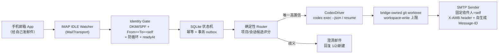

# Agent Mail Bridge — 可行性评估与整体阶段规划

> 状态：设计已定稿，待用户最终审阅
> 日期：2026-07-17
> 前置输入：`gmail-codex-bridge-handoff.md`（开发前研究交接文档，本文多处继承其安全设计）
> 定位变更：handoff 建议"私有、实验性"；本文按用户新目标调整为**面向公众的主流开源项目**

## 0. 一句话定位

**Email is the universal, firewall-friendly async transport for AI agents.**

用你自己的邮箱，控制你自己设备上的 coding agent（Codex 优先）；未来让多台设备上的 agent 通过邮件互相委托与协作（mesh）。

## 1. 可行性结论

**可行，且默认路径比 handoff 预设的更简单。** 依据三路调研（2026-07-17）+ 本地协议验证：

### 1.1 市场空间：半空白

| 项目 | Star | 状态 | 弱点 |
| --- | --- | --- | --- |
| slopus/happy | 22.7k | 活跃 | 移动端/WebSocket relay 通道，受控网络可能被封；非邮件 |
| JessyTsui/Claude-Code-Remote | 1.3k | 停滞 7 个月 | IMAP 轮询、发件人白名单（可伪造）、仅 Claude Code |
| agenticmail / aimx / robotomail | <200 | 各异 | 定位不同（给 agent 配邮箱 / 依赖第三方云） |

- 广义"远程控制本地 agent"已拥挤（happy + 各类 Telegram bot），但**邮件专用通道无强势在位者**。
- 需求真实：Claude Code Remote Control（`disableRemoteControl`）与 Codex cloud（workspace RBAC）均可被企业管理员强制禁用；邮件常是受控网络中唯一放行的异步通道。
- 差异化：① 事件驱动而非轮询；② DKIM 级身份验证（竞品是弱白名单）；③ 幂等/防循环/隔离 worktree 的工程深度；④ 多 agent 抽象（竞品均单 agent）。

### 1.2 技术可行性：全链路已核实

- **邮件侧**：个人 Gmail 的应用专用密码 + IMAP IDLE 政策面稳定（2025 起个人账户 IMAP 默认常开，无退役信号）；IDLE 秒级推送；QQ 邮箱/iCloud/Fastmail 同协议兼容。
- **Agent 侧**：`codex exec --json` / `codex exec resume` 为官方非交互接口（稳定）；app-server v2 协议表面齐全（`thread/*`、`turn/*`、审批通知族、`TurnStartParams.clientUserMessageId` 均已在本机 0.140.0 schema 中确认存在）。
- **已证伪的假设**：Codex 桌面 app 不显示外部创建的会话（独立 `session_index.jsonl`，已知 issue）。产品上不承诺"邮件任务出现在桌面列表"，改为 bridge 自有会话 + `codex exec resume` 续接。

### 1.3 核心风险与缓解

| 风险 | 等级 | 缓解 |
| --- | --- | --- |
| Google 收紧个人账户应用密码 | 中 | MailTransport 抽象；Gmail API transport 作后路；多邮箱服务商分散依赖 |
| Codex CLI 接口漂移（0.x） | 高频低危 | 版本兼容表 + contract tests + fail closed；优先用稳定的 `exec --json` |
| 安全事故毁掉声誉 | 低频高危 | 威胁模型第一天公开；DKIM 验证；默认最小权限；worktree 隔离；不做的事写清楚 |
| 邮件正文 prompt injection | 中 | 正文只进 sandbox 受限任务；路由层不给模型任何工具；净化管道 |
| happy 等在位者补邮件通道 | 中 | 快速发布 + 邮件专用深度（幂等/澄清/防循环不是一周能补的） |
| 合规叙事被误读为"绕过企业管控" | 中 | 见 1.4 |

### 1.4 合规叙事红线

- 定位表述：**"用你自己的邮箱控制你自己的设备"**（个人邮箱、个人设备、个人项目）。
- README/文档明确：不得用于违反雇主政策的场景；不建议绑定企业邮箱（Workspace 受管账户本就可禁应用密码）。
- 把安全与隐私文档（THREAT_MODEL / SECURITY / PRIVACY）作为公开卖点而非附录。

## 2. 关键决策记录（相对 handoff 的变更）

| # | 决策 | 结论 | 理由 |
| --- | --- | --- | --- |
| D1 | 默认邮件接入 | **IMAP IDLE + SMTP + 应用专用密码**；Gmail API + Pub/Sub 降级为后续可选高级模式 | 上手 2 分钟 vs 20-40 分钟；无 7 天 token/CASA/GCP 负担；天然多邮箱，服务 mesh 愿景。用户已确认 |
| D2 | MVP agent 范围 | **仅 Codex**，`AgentDriver` 接口先抽象 | 聚焦最小闭环；Claude Code（Agent SDK 成熟）v0.2 紧随。用户已确认 |
| D3 | handoff 方案 A（Connector 混合复用） | **保留为 P0 非阻塞储备实验**，产出 ADR，不进 MVP 代码 | 用户要求保留技术储备；但依赖 EXPERIMENTAL 接口，不作为主线依赖 |
| D4 | Codex 驱动接口 | MVP 用 `codex exec --json` + `exec resume`；app-server 驱动放 v0.3+（交互审批场景） | exec 稳定、语义够用；app-server 需锁 schema、维护成本高 |
| D5 | 路由 controller | v0.1 纯确定性路由 + 邮件澄清，**不调用模型路由** | handoff 已允许该降级；避免"无工具 controller"在 MVP 的实现成本；Phase 4 再评估 |
| D6 | 平台 | v0.1 支持 macOS（LaunchAgent）+ Linux（systemd user unit）；Windows 后置 | Node 跨平台成本低；Linux 覆盖 homelab/服务器人群，对开源增长重要 |
| D7 | 语言 | 代码/主文档英文；README 提供 zh-CN 翻译 | 业界主流开源的必然选择 |
| D8 | 桌面可见性 | 不承诺邮件任务出现在 Codex 桌面 app 列表 | 已证实的产品限制（独立 session index） |
| D9 | License 与可见性 | MIT；仓库自始 public | 生态惯例、传播摩擦最低；public 倒逼凭据卫生。用户已确认 |
| D10 | 包名/命令名 | npm 包 `agent-mail-bridge`（2026-07-17 查证未被占用）；bin 主名同名 + `amb` 短别名 | npm 上 `amb` 包已被占用，但 bin 命令名不受注册表约束。用户已确认 |

handoff 中**全部继承**的设计资产：命令/outbox 双状态机、幂等键（Message-ID 唯一索引 + 派生 intent ID）、防自发自收循环（outbox nonce/header）、澄清 token 流程、bridge-owned worktree 隔离、远程权限上限（不高于 workspace-write、禁 danger-full-access）、高风险动作 fail closed、脱敏日志、`setup/doctor/status/pause/resume` 命令面、卸载清理顺序。

## 3. v0.1 架构



### 3.1 模块边界

```text
agent-mail-bridge/
├── src/
│   ├── domain/          # 命令/outbox 状态机、身份策略、时间窗策略、风险策略（纯逻辑，无 IO）
│   ├── transports/      # MailTransport 接口 + imap-smtp 实现（后续 gmail-api、graph）
│   ├── drivers/         # AgentDriver 接口 + codex 实现（后续 claude-code；事件模型向 ACP 语义对齐）
│   ├── application/     # ingest / route / dispatch / deliver 用例编排
│   ├── store/           # SQLite + migrations
│   ├── daemon/          # 常驻进程、IDLE 保活、恢复
│   └── cli/             # setup 向导、doctor、status、pause/resume、logout
├── docs/                # architecture、threat-model、security、privacy、operations、compatibility
├── resources/           # launchd plist、systemd unit 模板
└── tests/               # unit / contract / integration / e2e
```

每个接口回答三个问题：做什么、怎么用、依赖什么。`MailTransport`（watch/fetch/send/markProcessed）与 `AgentDriver`（startTask/resumeTask/streamEvents/capabilities）是两条扩展轴，v0.2+ 的新邮箱和新 agent 只加实现不改核心。

### 3.2 IMAP 模式的可靠性映射（替代 handoff 的 Gmail API 机制）

| handoff 机制（Gmail API） | IMAP 等价物 |
| --- | --- |
| `historyId` 增量同步 | `UIDVALIDITY` + UID 高水位；重连后 `UID SEARCH` 补收 |
| Pub/Sub at-least-once → 先落库再 ack | IDLE 事件 → 先落库再推进高水位（同样 at-least-once + 唯一索引幂等） |
| `users.watch` 7 天续订 | IDLE ≤29 分钟主动重连 + 周期兜底轮询（处理 IDLE 静默失效窗口） |
| history 404 有界恢复 | `UIDVALIDITY` 变化时的有界重扫（按 INTERNALDATE + Message-ID 去重，不早于 readyAt） |
| Connector 发送无法自定义 header 的种种对账补偿 | **问题消失**：SMTP 完全控制 MIME，自生成 `Message-ID` + `X-AMB-Outbox-ID`，防循环识别在发送前即确定 |

### 3.3 身份验证（安全核心，强于全部现有竞品）

有效控制邮件必须同时满足：

1. `From` 与 `To` 的 addr-spec（RFC 5322 解析后）均严格等于配置的 self 地址；`CC` 为空、拒多收件人、v0.1 拒 alias/`+tag`；
2. **DKIM 因子**：收件方 `Authentication-Results` 显示 `dkim=pass` 且签名域与 self 域对齐（伪造 `From: 你@gmail.com` 的外部邮件无法取得 gmail.com 的 DKIM 签名；gmail.com DMARC p=none，不能指望 Gmail 替我们拦，必须自查此 header）——自发自收路径上该 header 的实际形态由 P0-3 实测确定，若内部投递缺失该 header 则以等价 `Received`/`X-Google` 特征替代，实测为准；
3. 非 bridge 自身出站（`X-AMB-Outbox-ID` / 已记录的自生成 `Message-ID` → 标记 `SYSTEM_ECHO`，永不进入路由）；
4. `INTERNALDATE` ≥ 首次 setup 持久化的 `readyAt`（首次安装绝不执行历史邮件）；
5. Message-ID 未处理过（SQLite 唯一索引）；
6. 可选加固（配置项，默认关）：设备配对 token（主题/正文携带短 token）。

正文规则继承 handoff：限大小、优先 text/plain、剥离签名与引用、拒附件、不访问链接、正文永远是"用户输入"而非配置。

### 3.4 派发与执行安全

- 项目发现：配置的 repo roots allowlist + git 扫描 + alias；路径一律 realpath + 拒符号链接逃逸；邮件不能指定任意路径。
- 写操作只发生在 **bridge-owned worktree**（从明确 base commit 创建，位于受控根目录）；用户当前 worktree 与未提交改动永不被触碰；合并回主分支必须本地确认。
- `codex exec -C <bridge-worktree> --sandbox workspace-write --json`；禁止 `danger-full-access` 与 `--dangerously-bypass-*`；邮件不能改模型/sandbox/approval。
- 非交互模式下无悬挂审批问题（出界操作直接失败并回信告知）；交互式审批转发（邮件批准）显式排除出 v0.1，留待 app-server 驱动阶段设计（一次性 nonce + 短 TTL + 绑定 diff hash）。
- 结果回信：限大小 + secret/路径/diff 脱敏；固定收件人为 self，机械禁止 CC/BCC/附件。

## 4. 开源工程化标准（"业界主流"清单）

**工程**
- TypeScript strict + ESM + Node ≥22；pnpm；单包起步（预留 monorepo 演进）。
- 候选核心依赖：imapflow（IMAP/IDLE）、nodemailer（SMTP）、postal-mime 或 mailparser（MIME）、better-sqlite3（实现计划阶段终选）。
- CI（GitHub Actions）：lint + typecheck + unit/contract tests，矩阵 macOS/Linux × Node 22/24；真实 E2E（消耗模型额度）只在手动 workflow/nightly 跑。
- 质量与安全：vitest；greenmail/容器化 IMAP 做 contract tests；gitleaks secret scanning；CodeQL；Dependabot；OpenSSF Scorecard badge。
- 发布：changesets（语义版本 + 自动 CHANGELOG）→ npm + GitHub Releases；**Codex CLI 版本兼容表**随每版发布。

**体验（上手门槛 < 5 分钟是硬指标）**
- `npx agent-mail-bridge setup`：交互式向导——引导开 2FA/生成应用密码 → 连接自检 → 发送/接收一封测试邮件闭环 → 安装 LaunchAgent/systemd unit。
- `doctor`：连接、DKIM 自检、时钟、Codex CLI 版本、权限位、worktree 根目录逐项体检。
- README：hero demo GIF（手机发邮件 → 电脑上 codex 跑 → 手机收到结果）+ 3 分钟 quickstart + 明确的"不做什么"。

**社区**
- SECURITY.md（漏洞披露流程）、CONTRIBUTING.md、CODE_OF_CONDUCT.md、issue/PR 模板、GitHub Discussions、公开 roadmap（GitHub Projects）、good first issue 标签。
- 文档站（VitePress，后置到 Phase 6）：architecture / threat model / privacy / FAQ / 多邮箱配置指南。

## 5. 阶段路线图

> 排序即依赖序；不承诺日历日期。参考量级：全程以 agent 辅助开发，v0.1.0 公开发布约 6-10 周。

### Phase 0 — 仓库与工程骨架
CI/lint/test/secret-scanning 全绿的空壳；docs 骨架 + THREAT_MODEL v0 + AGENTS.md/CLAUDE.md；锁定并记录 Codex CLI/Node 版本；生成 app-server schema 存档（供 P0-4 与 v0.3 使用）。
**出口**：`pnpm test` 全绿，CI 徽章亮起。

### Phase 1 — P0 spikes（Go/No-Go 实验，每项产出 ADR）
- **P0-1 IMAP 稳定性**：Gmail IDLE 29 分钟重连、断线/休眠补收、UIDVALIDITY 行为、自发自收邮件在 INBOX 的可见性与 label 形态；
- **P0-2 Codex 驱动**：`exec --json` 事件流拿 session id（验证已知 issue #3817 现状）、`exec resume` 续接、sandbox 边界在 worktree 的实效、`--output-schema` 行为；
- **P0-3 身份因子**：自发自收邮件的 `Authentication-Results`/DKIM header 实测；外部伪造 From 邮件的 header 对照组；确定身份因子集合；
- **P0-4（储备，非阻塞）**：Connector 混合复用实验（AppsList/DynamicToolCall 无模型调用），仅产出 ADR，不进 MVP 代码。
**出口**：P0-1/2/3 全 Go（任一 No-Go 则回到架构调整）；P0-4 允许 timebox 结束。

### Phase 2 — 可靠事件核心
MailTransport(imap-smtp) + SQLite 状态机 + 事务 outbox + 防循环（SYSTEM_ECHO 路径）+ 时间窗策略 + `dry-run` 模式 + 崩溃恢复测试（每个事务边界注入崩溃）。
**出口**：模拟 IMAP 下，重复投递/乱序/崩溃重启均不产生重复命令；自发系统回信 100% 被识别为 echo。

### Phase 3 — 安全派发闭环
Identity Gate（含 DKIM 因子）+ 项目 allowlist/索引 + bridge-owned worktree manager + CodexDriver + ACK/完成回信。
**出口**：真实 Gmail + 测试仓库端到端：手机发一封自然语言邮件 → 新任务在隔离 worktree 执行 → 收到脱敏结果回信；伪造 From 对照组 0 触发。

### Phase 4 — 路由与澄清
确定性候选检索/评分（含 Gmail thread ↔ codex session 映射、`继续/新建`意图）+ 澄清邮件流（token 绑定 + 回复 `1/2/新建`）+ 每会话串行队列。评估是否引入无工具 controller（不满足机械限权则继续纯确定性）。
**出口**：MVP 验收标准（§6）中路由相关条目全过。

### Phase 5 — 本机产品化
`setup` 向导（5 分钟硬指标）+ `doctor` + launchd/systemd 安装 + `status/pause/resume/logout` + 脱敏日志轮转 + 卸载清理顺序。
**出口**：一台干净机器上按 README 从零到收到第一封结果邮件 ≤ 10 分钟。

### Phase 6 — v0.1.0 公开发布
README 打磨 + demo GIF + docs 站 + SECURITY.md 披露流程演练 + npm 发布 + Show HN / r/LocalLLaMA / X 发布；邀请安全审阅。
**出口**：v0.1.0 tag + npm 包 + 首批外部 issue 得到响应。

### Phase 7 — v0.2：第二个 agent 与多邮箱
ClaudeCodeDriver（Agent SDK：resume/流式/`canUseTool`）；QQ 邮箱/iCloud/Fastmail 配置指南与 contract tests；体验打磨（每日 digest、结果分页）。

### Phase 8 — v0.3+：高级模式与 mesh
- Gmail API transport（handoff 原方案复活为高级模式，含 P0-4 结论的应用）；Outlook OAuth transport；
- app-server 驱动（交互审批的邮件转发：一次性 nonce + 短 TTL + diff hash 绑定）；
- **mesh 预研**：peer allowlist、agent↔agent 邮件委托协议（每对 peer 共享密钥 HMAC + DKIM 双因子、任务 envelope 格式、防转发/重放）、多设备路由。mesh 进入实现前单独走一轮 brainstorming/spec。

## 6. MVP（v0.1.0）验收标准

继承 handoff 并按 IMAP 路线调整：

- 空闲 24 小时模型调用数为 0；无效邮件与窗口外邮件模型调用数为 0；
- 在线时有效邮件到开始派发 P95 < 60 秒；
- 伪造 From、外部发件人、多收件人、系统回信：0 触发（DKIM + echo gate）；
- 每封控制邮件恰好一个持久 dispatch intent；崩溃/重启/重复投递不产生重复派发；
- 首次安装不执行历史邮件；
- 用户当前 worktree 与未提交改动永不被写；所有写操作可在 bridge worktree 中 `git log` 审计；
- 低置信永远澄清而不猜测；澄清回复必须绑定 token + thread + 候选版本；
- 发送结果不确定时隔离对账，不盲目重发（effectively-once，不宣称 exactly-once）；
- 新机器从 README 到首封结果邮件 ≤ 10 分钟；
- 仓库无任何真实凭据/邮箱/路径；CI 含 secret scanning。

## 7. 开放问题（进入实现计划前需回答）

1. LICENSE 版权行署名：`Copyright (c) 2026 <?>` 待用户提供署名（GitHub 用户名或真名）；LICENSE 文件在 Phase 0 创建。
2. 凭据存储：macOS Keychain（`security` CLI）确定；Linux 上 libsecret 可用性差异大，是否接受 0600 加密文件降级？
3. 澄清邮件的候选展示格式（移动端可读性）在 Phase 4 前做一次真机走查。
4. P0-4 的 timebox（建议 ≤3 个工作日）。

开发期测试凭据约定：专用测试 Gmail 账户的应用专用密码存放于 `~/.secrets/amb-test.env`（`AMB_TEST_IMAP_USER` / `AMB_TEST_IMAP_PASS`，目录 0700、文件 0600），仅运行时读取；凭据不进入 git、日志、对话与任务提示词。

## 8. 调研与验证来源

- 竞品格局、企业管控、历史安全教训：2026-07-17 三路调研报告（GitHub API star 数实测；Claude Code Remote Control 文档、Codex Admin Setup 文档）。
- 邮件政策：Google 应用专用密码支持文档、Workspace LSA 过渡公告、Microsoft basic auth 退役公告、rclone/lieer OAuth 实践、CASA 定价。
- Agent 接口：developers.openai.com（app-server / noninteractive / SDK）、code.claude.com（Agent SDK / headless）、zed.dev（ACP）、openai/codex 已知 issues（#14389、#3817）。
- 本地验证（本机 codex-cli 0.140.0）：`codex exec --help` 参数面；`codex app-server generate-json-schema` 产出的 v2 schema（`TurnStartParams.clientUserMessageId`、`AppsList` EXPERIMENTAL 标注等）。
